# 🎙️ PersonalPlex API Gateway

<div align="center">

**Secure API Gateway for PersonaPlex/Moshi Speech-to-Speech Models**

[](https://fastapi.tiangolo.com)
[](https://python.org)
[](https://github.com/kyutai-labs/moshi)
[]()

</div>

---

## 📋 Overview

The **PersonalPlex API Gateway** serves as a secure entry point for your private speech-to-speech infrastructure. It sits between your client applications and the raw Moshi/PersonaPlex Model Server, adding essential enterprise features:

- 🛡️ **API Key Authentication**: Secure your expensive GPU resources.
- ⚡ **Rate Limiting**: Prevent abuse and manage load.
- 📂 **Offline Inference**: Batch process audio files via REST API.
- 🔄 **Real-Time Streaming**: Full-duplex WebSocket proxy for live conversations.

## 🏗️ Architecture

```mermaid
graph LR
    Client[📱 Client App/Script]
    Gateway[🛡️ API Gateway :8000]
    Moshi[🧠 Moshi Server :8998]
    Auth[🔑 api_keys.json]
    Disk[💾 File System]

    Client -- "WebSocket (Stream)" --> Gateway
    Client -- "REST (Moshi CLI)" --> Gateway
    Gateway -- "Validate Key" --> Auth
    Gateway -- "Clean Audio Stream" --> Moshi
    Gateway -- "Batch Process" --> Disk
    Disk -.-> Moshi
    Moshi -- "Generated Audio + Text" --> Gateway
    Gateway -- "Response" --> Client
```



## ✨ Key Features

| Feature | Description |
| :--- | :--- |
| **🔐 Secure Access** | Validates `X-API-Key` headers or query parameters before allowing access. |
| **🛑 Rate Limiting** | Configurable requests-per-minute (RPM) limits per API key. |
| **🗣️ Real-Time** | Proxies WebSocket connections efficiently for low-latency streaming. |
| **📥 Offline Mode** | Upload a WAV file, get a spoken response WAV file back (perfect for voicemail systems). |

## 🚀 Getting Started

### Prerequisites

- **Python 3.8+**
- **Moshi / PersonaPlex** installed and running on port `8998`.
- [Optional] **FFmpeg** for audio processing.

### Installation

1.  **Clone the Repository**
    ```bash
    git clone https://github.com/your-username/API-Wrapper-PPLEX.git
    cd API-Wrapper-PPLEX
    ```

2.  **Install Dependencies**
    ```bash
    pip install -r requirements.txt
    ```
    *Note: `requirements.txt` should include: `fastapi`, `uvicorn`, `websockets`, `python-multipart`, `aiofiles`.*

3.  **Configure Environment (Optional)**
    Create a `.env` file or set environment variables:
    ```bash
    export MOSHI_HOST="localhost"
    export MOSHI_PORT="8998"
    export RATE_LIMIT_RPM="60"
    export PERSONAPLEX_REPO="/path/to/moshi/repo"
    ```

## 🔑 Team Onboarding & Key Management

### 1. The Admin Secret (Master Password)
The `admin_secret` is your "master key" for the gateway. It allows you to generate and revoke access for others.
*   **Default**: `change-me-in-production`
*   **Production**: Set this via the `ADMIN_SECRET` environment variable.

### 2. Generating Keys for Your Team
As an administrator, you will generate unique API keys for each developer or application (e.g., "Mobile App v1", "Dev Team - Mike").

**Command:**
```bash
curl -X POST http://localhost:8000/admin/keys/generate \
  -H "X-Admin-Secret: YOUR_ADMIN_SECRET" \
  -F "name=Frontend Team" \
  -F "description=Key for the main web interface"
```

**Response:**
```json
{
  "api_key": "ppx-a1b2c3d4...", 
  "name": "Frontend Team",
  "message": "Store this key securely — it cannot be retrieved again."
}
```
*⚠️  Share the `api_key` with your team member via a secure channel (e.g., 1Password). They will use this key for all their requests.*

### 3. Using the API (For Developers)

#### 🌊 Real-Time WebSocket
Connect to the stream using your provided `api_key`:
`wss://your-server:8000/ws/stream?api_key=ppx-a1b2c3d4...`

#### 📁 Offline Inference (REST)
Submit audio files for processing:
```bash
curl -X POST http://localhost:8000/v1/inference \
  -H "X-API-Key: ppx-a1b2c3d4..." \
  -F "audio=@input.wav" \
  -F "persona=You are a helpful assistant." \
  --output response.wav
```

## 📜 License

This project is open-source and available under the [MIT License](LICENSE).
